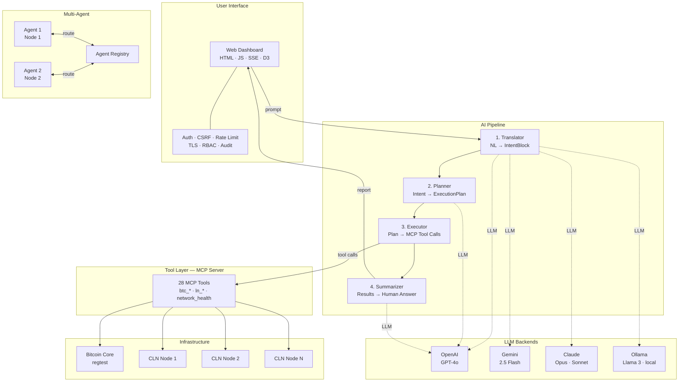

# Lightning Network AI Agents

[](https://github.com/StevOB93/lightning-network-ai-agents/actions/workflows/ci.yml)


A research harness that lets AI agents autonomously operate a Lightning Network using natural language. The system translates plain-English instructions into structured execution plans, runs them against real Bitcoin and Lightning nodes via the [Model Context Protocol (MCP)](https://modelcontextprotocol.io/), and reports results back in human-readable form — all on a local regtest network with no real funds at risk.

> **CSCI 499 — Senior Capstone Project, Texas A&M University–Commerce**

---

## Architecture

The system is organized as a **five-layer stack** with a **four-stage AI pipeline** at its core:



### Pipeline Stages

| Stage | Input | Output | Uses LLM? |
|-------|-------|--------|-----------|
| **Translator** | Natural language prompt | `IntentBlock` — goal, intent type, context, success criteria | Yes |
| **Planner** | `IntentBlock` | `ExecutionPlan` — ordered steps with dependencies and rationale | Yes |
| **Executor** | `ExecutionPlan` | `StepResult[]` — MCP tool calls with results, retries, value chaining | No |
| **Summarizer** | Tool results + original prompt | Human-readable answer with success/failure verdict | Yes |

**Multi-turn context**: the last 4 exchanges are carried forward — follow-up prompts like *"now pay that invoice"* work naturally.

**Goal verification**: after state-changing operations (payments, channel opens), a read-only MCP check confirms the action succeeded.

---

## Tech Stack

| Layer | Technology |
|-------|-----------|
| Blockchain | Bitcoin Core (regtest) |
| Payment Network | Core Lightning (CLN) |
| Tool Protocol | Model Context Protocol (MCP) — 28 tools |
| AI Pipeline | Python 3.10+, 4-stage pipeline with per-stage LLM config |
| LLM Backends | OpenAI (GPT-4o), Anthropic (Claude), Google Gemini (2.5 Flash), Ollama (local) |
| Multi-Agent | Agent registry, inter-agent routing, per-node pipeline instances |
| Safety | GuardedBackend (rate limiting, exponential backoff, circuit breaker) |
| Security | Session auth, CSRF, rate limiting, RBAC, TLS, audit logging, secrets encryption |
| Web UI | Vanilla HTML/CSS/JS, Server-Sent Events (SSE), D3.js network graph |
| Testing | 520 tests — pytest on GitHub Actions CI |

---

## Quick Start

### 1. Install (one-time)

```bash
./install.sh
```

Installs Bitcoin Core, Core Lightning, Python venv, and all dependencies.

### 2. Configure

```bash
cp ln-ai-network/.env.example ln-ai-network/.env
```

Edit `ln-ai-network/.env` and set your LLM backend:

| Backend | Configuration |
|---------|--------------|
| **OpenAI** (default) | `OPENAI_API_KEY=sk-...` |
| **Ollama** (local, free) | `LLM_BACKEND=ollama` |
| **Gemini** | `LLM_BACKEND=gemini` and `GEMINI_API_KEY=...` |

### 3. Start

```bash
./start.sh
```

The web UI opens automatically at **http://127.0.0.1:8008**. Type a prompt:

```
Open a 500,000 sat channel from node 1 to node 2.
```

### 4. Stop

```bash
./stop.sh
```

---

## Project Layout

```
lightning-network-ai-agents/
├── start.sh / stop.sh / install.sh     # Top-level launchers
├── CLAUDE.md                            # Developer guide (Claude Code)
├── docs/                                # Full documentation site
│   ├── 0.Quickstart/                    #   Setup walkthrough
│   ├── 1.Setup/                         #   Install & troubleshooting
│   ├── 2.Architecture/                  #   System design deep-dive
│   ├── 3.Components/                    #   MCP tools reference
│   ├── 4.Runbooks/                      #   Operational procedures
│   └── 5.Roadmap/                       #   Future work
│
└── ln-ai-network/                       # Main codebase
    ├── ai/
    │   ├── pipeline.py                  #   4-stage pipeline coordinator
    │   ├── agent.py                     #   Legacy single-agent mode
    │   ├── models.py                    #   IntentBlock, ExecutionPlan, StepResult
    │   ├── tools.py                     #   MCP tool registry & normalization
    │   ├── controllers/                 #   Translator, Planner, Executor, Summarizer
    │   ├── llm/                         #   LLMBackend ABC + 3 adapters + GuardedBackend
    │   ├── core/                        #   Backoff, rate limiter, config, scheduler
    │   └── tests/                       #   200+ tests (no API keys required)
    ├── mcp/                             #   MCP server (23 tools)
    ├── scripts/                         #   Boot sequence, UI server
    ├── web/                             #   Frontend dashboard
    └── .env.example                     #   Environment template
```

---

## Running Tests

```bash
cd ln-ai-network
python -m pytest ai/tests/ -v
```

All tests run without API keys or live infrastructure using mock fixtures.

---

## Documentation

Detailed guides are in the [`docs/`](docs/) folder:

| Section | Contents |
|---------|----------|
| [Quickstart](docs/0.Quickstart/) | Get the demo running in minutes |
| [Setup](docs/1.Setup/) | Installation, configuration, troubleshooting |
| [Architecture](docs/2.Architecture/) | System design, data flow, layer breakdown |
| [Components](docs/3.Components/) | MCP tools reference, tool categories |
| [Runbooks](docs/4.Runbooks/) | Start/stop procedures, debugging |
| [Roadmap](docs/5.Roadmap/) | Future work and research directions |

---

## Team

| Name | Role |
|------|------|
| **Stephan Beacham** | Project lead, infrastructure, documentation |
| **Luke Thompson** | CI/CD, testing, integration |
| **Joshua Kramer** | LLM backend contract, pipeline architecture |
| **Tyler Pham** | Gemini backend, front-end UI |
| **Caleb Lesher** | Documentation, research |

---

## License

This project is licensed under the [MIT License](LICENSE).
